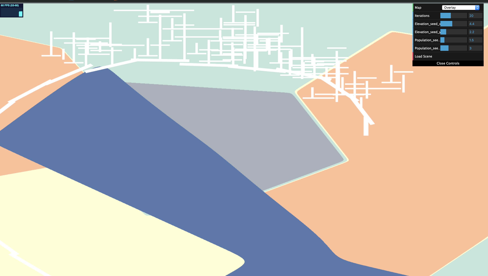

CIS 566 Homework 5: Road Generation
=====================================

Written by Julia Chun (hyojchun)

Project Results
----------------
### Output

Demo can be found here: https://hjchun96.github.io/hw05-road-generation/

Below is the final image generated by the code:

Overall, I struggled a lot to get the correct behavior in terms of displaying and expansion, and there still
seem to be some glitches with carving highway segments together and road stepping into water but the code roughly achieves the desired behavior.

Implementation Details
----------------------

### Terrain generation
* Voronoi noise that spits out a different value based on the x and y coordinate as well as a random seed was used to
generate both the Population Density and Elevation map. A threshold of 0.3 was used for the elevation map to separately
the land from water, which are colored appropriately. For population density, red indicates highest density and the bluer-hues
represents lower density.

### Road and Highway Generation

* A basic L system composed of `Turtle.ts` and `Lsystem.ts` dictate the rules for road and highway generation. Each generates its own stack of
turtles which are used to draw out the squares.
* Highways are generated by a combination of stepping forward and turning in a random angle. Three random angles between 0 and 90 are generated and
the final direction to turn is decided by selecting
the angle that leads to the location with highest population density based on the voronoi noise. The highway system is self-sensitive,
and this is checked after each move forward - if a potential crossing is detected, the end position is updated accordingly.

* Roads are generated by branching out from the midpoint of an `Edge`, which is simply a segment of a highway. From there on,
the roads expand in a manner perpendicular to each other depending on the number of iterations specified by the user.

### GUI
The user has control over the
* Type of Map to display, among Elevation, Population Density, and Overlay.
* Number of iterations, which decides how many times the grammar should be expanded.
* Population Seed and Elevation Seed, which updates both the flat shader that displays the map and
changes the behavior of the LSystem road generation.
